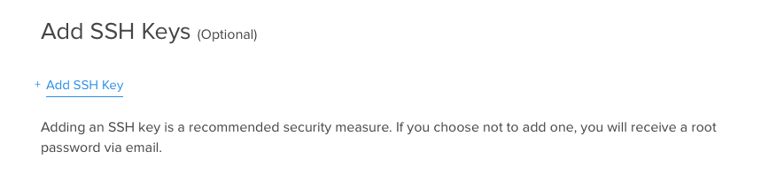

# Exploring DigitalOcean

DigitalOcean is an Infrastructure as a Service provider. What that means is we provide virtual compute resources which you can run your applications on. DigitalOcean provides multiple operating systems and applications you can build on. We call these compute resources Droplets. 

## Booting a DigitalOcean Droplet

As a warm up exercise, we can practice booting up Droplets using the Cloud GUI.


DigitalOcean provides a myriad of options for configuring your Droplet.

You can select size...


And Region...


And the type of Image...


Images can also be wholly configured applications...


You can configure settings...


And provide a SSH key...



## Lab 1: Creating a DigitalOcean Droplet

In our first lab, we'll create a Droplet that will serve as our home base. This will be easier as it won't require any local configuration on your computer. Before starting, think of an identifier to use, so you will be able to find your Droplets later on. An example of an identifier is <first initial><last name>. (i.e. `bliles`)

1. Log into Cloud

1. Create a Droplet from Console. During the workshop, we will be using a team account if you do not already have one. Create a Droplet with the following parameters: 
```
Hostname: <identifier>-lab1
Size: 512 MB
Region: NYC3
Image Ubuntu 14.04 x64
```


## DigitalOcean's API

This isn’t the only way to create Droplets. We can also use the DigitalOcean API to create Droplets. To use our API, you’ll have to generate an API token.


The DigitalOcean API has a documentation site at [https://developers.digitalocean.com/documentation/v2/](https://developers.digitalocean.com/documentation/v2/)


## Lab 2: Using the DigitalOcean API

In this lab, we will use the DigitalOcean API to create a Droplet from the command line.

1. Create SSH key

1. Create an OAuth token. Make sure to take note of your token as it won't be displayed again.

1. Add your OAuth token to workshop environment.
```sh
export DIGITALOCEAN_TOKEN=<your token>
```

1. Create Workshop Droplet. To create a Droplet, you can use the following as a guide.
```sh
curl -X POST -H 'Content-Type: application/json' \ 
 -H 'Authorization: Bearer <token>' \
 -d '{"name":"<identifier>-api-1","region":"nyc3","size":"512mb","image":"ubuntu-14-04-x64"}' \
 "https://api.digitalocean.com/v2/droplets"
```

1. Wait for Droplet to come up

1. Review Droplet in Cloud.

1. Review Droplet from API.
```sh
curl -X GET -H 'Content-Type: application/json' \
-H 'Authorization: Bearer <token>' \
"https://api.digitalocean.com/v2/droplets/<droplet id>"
```

1. Log in to Droplet.
```sh
ssh root@<droplet ip>
```
